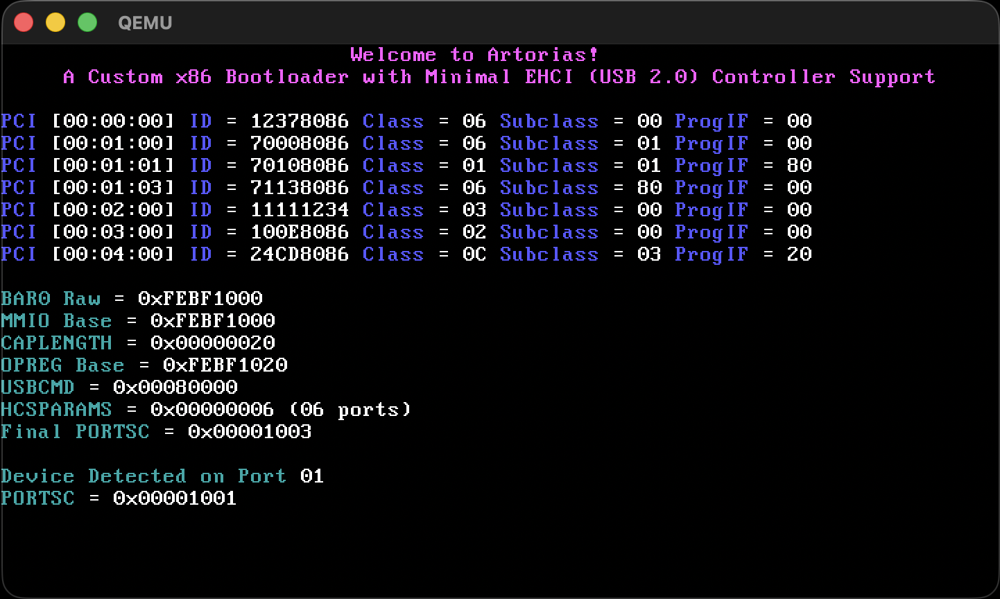

<div align="center">
  
  # Artorias 
  
</div>

<div align="center">

<div align="center">

</div>

<br>

[]()
[]()

<p>
  
_IMPORTANT: Control transfers (device descriptors and string descriptors) are under active development._

</p>
  
</div>

<p>Artorias is a bare-metal 32-bit x86 boot system that starts from the master boot record (MBR), loads a second-stage bootloader, transitions to 32-bit protected mode, and executes a C kernel with minimal EHCI (USB 2.0) controller support.</p>

### Table of Contents

- [Documentation](#documentation)
- [Features](#features)
- [Requirements](#requirements)
- [Building](#building)
- [Limitations](#limitations)
- [Resources](#resources)

## Documentation
The documentation for the bootloader code can be found on my Medium page titled "[Writing a 32-bit x86 Bootloader from Scratch](<https://medium.com/@sumeyyaaktas/part-1-writing-a-custom-x86-bootloader-with-ehci-support-from-scratch-43cb7a5b736d>)". The documentation for the rest of the code will be up as soon as possible, and it will likely be documented using comments. 

## Features
- Custom x86 bootloader (MBR-based)
- Freestanding 32-bit kernel
- VGA text output, serial port (COM1), and programmable interval timer (PIT) drivers
- PCI bus enumeration
- Minimal EHCI (USB 2.0) controller support
  - Detects EHCI controllers via PCI class/subclass/progIF
  - Maps MMIO registers and parses EHCI capability and operational registers
  - Properly halts, resets, and starts the controller
  - Powers USB ports and detects connected high-speed devices
  - Performs basic port resets and reports connection status

## Requirements
- GCC Cross-Compiler (i686-elf-gcc)
- GNU Make
- NASM 
- QEMU

## Building
```bash
make all    # Build boot sector and disk image
make run    # Run in QEMU
make clean  # Clean build artifacts
```
> The ```make run``` command attaches a virtual USB EHCI controller to QEMU to test the driver logic.

## Limitations
- This project implements an EHCI (Enhanced Host Controller Interface) driver, which only handles USB 2.0 high-speed (480 Mbps) devices.
Low-speed (1.5 Mbps) and full-speed (12 Mbps) devices require companion controllers (UHCI/OHCI) and port handoff logic, which are not implemented. USB 3.x (xHCI) devices are also unsupported.
- The driver does not issue additional control transfers to retrieve string descriptors (such as manufacturer name, product name, or serial number). As a result, devices cannot be identified by human-readable names and are only detected at a structural level.

## Resources
- [Writing a Bootloader from Scratch - Carnegie Mellon University](<https://www.cs.cmu.edu/~410-s07/p4/p4-boot.pdf>)
- [Rolling Your Own Bootloader - OSDev Wiki](<https://wiki.osdev.org/Rolling_Your_Own_Bootloader>)
- [USB - OSDev Wiki](<https://wiki.osdev.org/Universal_Serial_Bus>)
- [EHCI - OSDev Wiki](<https://wiki.osdev.org/Enhanced_Host_Controller_Interface>)

## License

This project is licensed under the Apache License 2.0. See the [LICENSE](./LICENSE) file for details.
